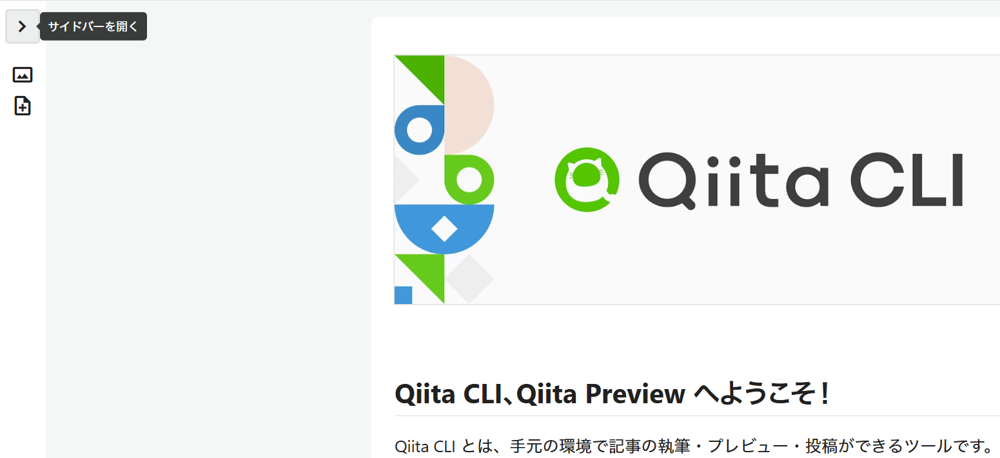

# Qiita

Qiita に投稿する記事を Markdown で管理しているリポジトリです。[**Qiita CLI**](https://github.com/increments/qiita-cli) を使っています。

# 手順

1. 以下を実行し、新規記事を `/public/*.md` として作成します
   ```
   npx qiita new <記事の名前>
   ```
2. 以下を実行し **http://localhost:8888** にアクセスすると、投稿前の記事をプレビューできます
   ```
   npx qiita preview
   ```
   
   ※ プレビューするには、左上の「＞」から**サイドバーを開く**必要があります
3. `main` ブランチに push すると Qiita に投稿する Actions が走ります

# 参考

- [**Qiitaの記事をGitHubリポジトリで管理する方法** - Qiita](https://qiita.com/Qiita/items/32c79014509987541130)